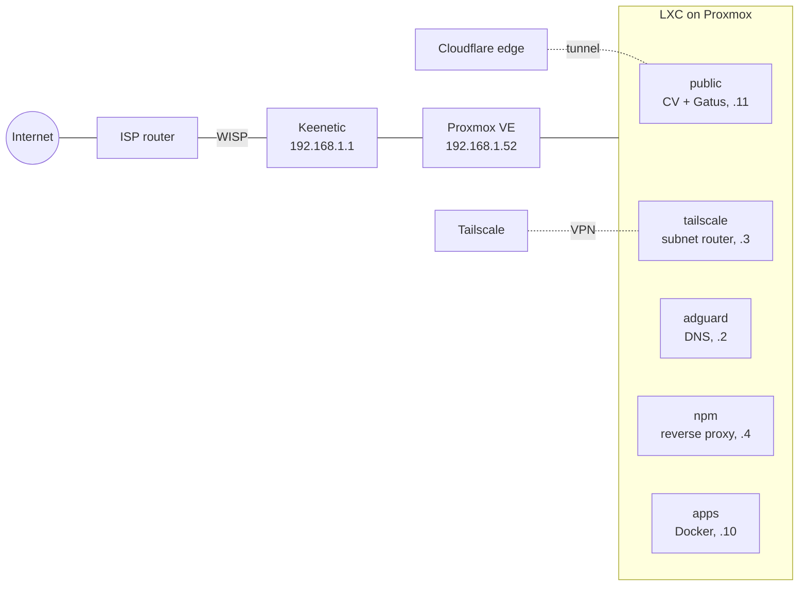

# homelab

Infrastructure code and service configs for my home lab: one mini-PC running Proxmox VE, a handful of LXC containers, and two public pages published through Cloudflare Tunnel.

Live pages:

- CV: <https://cv.kalik8s.ru>
- Status (Gatus): <https://status.kalik8s.ru>

## Hardware

Lenovo ThinkCentre M920x: Intel Core i7-8700K (6 cores, 12 threads), 32 GB RAM, one 500 GB NVMe SSD with ZFS.

## Network



- The home network sits behind two NAT layers (ISP router, then Keenetic over WISP), so nothing is port-forwarded.
- Remote access goes through Tailscale; the `tailscale` container advertises `192.168.1.0/24`.
- AdGuard Home is the DNS server for the whole LAN and for Tailscale clients. It also serves the internal zone `home.kalik8s.ru`, with a wildcard pointing at the reverse proxy.
- Nginx Proxy Manager terminates TLS for internal services with a wildcard Let's Encrypt certificate issued through the Cloudflare DNS-01 challenge.
- Only the `public` container is reachable from the internet, through a remotely managed Cloudflare Tunnel.

## What runs where

| Guest | ID | Services |
|---|---|---|
| `adguard` | 100 | AdGuard Home |
| `tailscale` | 101 | Tailscale subnet router and exit node |
| `npm` | 102 | Nginx Proxy Manager |
| `apps` | 103 | Homepage, Paperless-ngx, Speedtest Tracker, Uptime Kuma |
| `public` | 104 | CV site (nginx), Gatus, cloudflared |

## Repository layout

```
terraform/   Proxmox LXC guests and Cloudflare tunnel + DNS (bpg/proxmox, cloudflare/cloudflare)
services/    docker compose files and app configs, one directory per LXC
host/        files placed on the Proxmox host by hand (systemd units, apt hook, sshd drop-in)
```

## Terraform

The guests existed before this repo, so they were adopted with `import` blocks instead of being recreated. Every container has `prevent_destroy`.

```sh
cd terraform
cp terraform.tfvars.example secrets.auto.tfvars   # fill in tokens, never committed
terraform init
terraform plan
```

State is kept locally and is not committed. The Proxmox API token belongs to a dedicated `terraform@pve` user.

## Secrets

Nothing secret is committed: `.env` files, `*.tfvars`, and Terraform state are ignored, and every secret file has a `*.example` next to it. The repo is checked with `gitleaks` before each push.

## Install notes

Proxmox was installed without a monitor or keyboard. `kexec` into the installer hung on this hardware, so the unattended installer was network-booted instead: iPXE (`snponly.efi` with an embedded script) chain-loads the kernel, initrd and the installer ISO over HTTP, and the answer file is fetched over HTTP too. The Keenetic DHCP server needed `next-server`/`bootfile` set explicitly, because the Intel PXE ROM ignores options 66/67.
